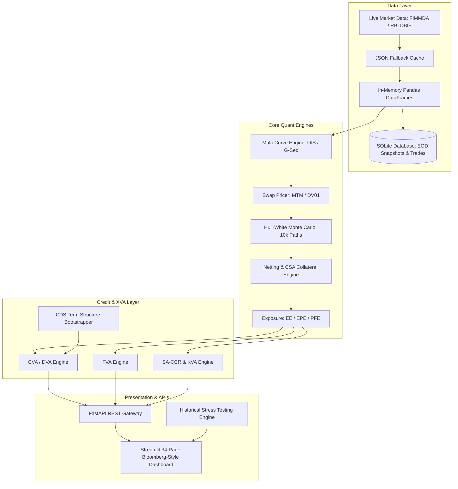

# INR OTC Derivatives Risk & Multi-Asset XVA Analytics Platform (V4 Production Tier)

## Comprehensive Technical Architecture & Feature Documentation

---

## 1. Project Overview

**Project Name:** End-to-End INR Counterparty Risk & Multi-Asset XVA Analytics Platform (V4)
**Objective:** A full-stack, production-grade quantitative finance system engineered for pricing, risk management, stress testing, and regulatory capital computation on Indian OTC interest rate derivatives. 

Unlike generic Black-Scholes or USD SOFR academic projects, this platform is deeply specialized for the **Indian Rates Market**. It processes real-time FBIL MIBOR benchmarks, RBI DBIE sovereign curves, and synthetic Indian corporate credit models, mirroring the exact infrastructure used by Counterparty Credit Risk (CCR) and XVA desks at major investment banks operating in India (e.g., JPM, Nomura, Barclays, SBI, HDFC).

---

## 2. Platform Architecture

The V4 architecture adopts an institutional **microservices and batch-processing design**, completely decoupling the risk engines from the data layer and the UI. It now features a true multi-asset engine, incorporating both Rates and Equity dynamics.



---

## 3. Data Ingestion & Storage Layer

The platform runs a **3-Tier Fallback Data Pipeline** to guarantee 100% uptime even if external APIs fail.

### 3.1 Live Market Data Scrapers
- **FBIL / FIMMDA:** Scrapes the daily OIS Excel files directly from `fimmda.org` to build the overnight index swap curve (1W to 10Y).
- **RBI DBIE:** Hits the `dbie.rbi.org.in` REST endpoints for live G-Sec yields, Repo rates, and historical MIBOR trajectories (used for volatility calibration).

### 3.2 Resilience & Caching
If the live fetch succeeds, data is saved to `data/raw/fallback_cache.json`. If a server is down or the user is offline, the platform seamlessly degrades to the JSON cache. If no cache exists, it degrades to synthetic hardcoded Indian market fallback arrays.

### 3.3 SQLite V3 Database
An End-Of-Day (EOD) Risk Engine (`src/eod/risk_engine.py`) writes exact structural snapshots of the risk calculations into an SQLite relational database (`db/models.py`):
- `trades` / `counterparties`: Reference data.
- `curve_snapshots`: Saves the full OIS discount factors daily.
- `market_data_snapshots`: Captures Repo rates and MIBOR.
- `xva_results`: Stores daily CVA, FVA, KVA, EAD, and PFE metrics per counterparty.

---

## 4. Multi-Curve Construction & Swap Pricing

### 4.1 Multi-Curve Bootstrapping
Modern interest rate derivatives require dual-curve pricing.
- **Discounting Curve (OIS):** Bootstrapped from FBIL MIBOR OIS par rates. Uses piecewise log-linear interpolation for discount factors.
- **Forwarding Curve (G-Sec / Term MIBOR):** Bootstrapped separately to generate accurate floating-leg cash flows, capturing the basis spread between sovereign and overnight risks.

### 4.2 Trade Valuations
- Computes Mark-to-Market (MTM) for Pay-Fixed and Receive-Fixed INR IRS and OIS trades.
- Calculates exact **Par Swap Rates** and first-order sensitivities (**DV01** & **PV01**).

---

## 5. Monte Carlo Simulation Engine (EE/PFE)

To compute future counterparty exposure, the platform uses a highly optimized, vectorized **Hull-White One-Factor (HW1F) model**.

### 5.1 Stochastic Differential Equation
```
dr(t) = [θ(t) - a * r(t)] dt + σ dW(t)
```
- **θ(t):** Drift function calibrated to exactly reproduce the current bootstrapped OIS zero curve.
- **a (Mean Reversion) & σ (Volatility):** Calibrated from historical MIBOR data fetched from RBI DBIE.

### 5.2 Simulation Execution
Generates **10,000 future interest rate paths** across monthly time steps up to the longest trade maturity. At each time step, all trades in the portfolio are repriced, resulting in a matrix of future MTMs.

### 5.3 Multi-Asset & Equity Monte Carlo
For hybrid portfolios, the engine extends beyond HW1F to support **Geometric Brownian Motion (GBM)** and **Heston Stochastic Volatility** models for equity underlying assets. The hybrid exposure cube natively correlates rate and equity drivers, capturing cross-asset dependency.

---

## 6. Netting & CSA Collateral Engine

Real-world exposure is rarely additive; it depends on ISDA Master Agreements and Credit Support Annexes (CSAs).

### 6.1 Multi-Trade Netting
- Aggregates the 10,000 MTM paths of all trades under a specific counterparty netting set.
- Calculates portfolio-level **Expected Exposure (EE)**, **Expected Positive Exposure (EPE)** (capped at a 1-year horizon per Basel rules), and **Potential Future Exposure (PFE 95%)**.

### 6.2 CSA Collateral Simulation
Models the actual posting of margin:
- **Parameters:** Thresholds, Minimum Transfer Amounts (MTA), and **Margin Period of Risk (MPoR)**: The close-out delay (e.g., 10-14 days). The engine accurately resolves the exact MPoR delay independently of the simulation grid resolution using continuous-time interpolation (`t - δ`). Crucially, it applies a **Brownian diffusion correction** `√(δ/dt)` to the interpolated gap when the grid is coarser than the MPoR window, preventing the dangerous under-estimation of collateralised exposure variance that plagues naive grid-clamped models.
- Calculates **Expected Negative Exposure (ENE)** explicitly from the negative tail of the collateralized paths, which feeds the Debit Valuation Adjustment (DVA).

---

## 7. Credit Analytics & Bootstrapping

To compute the cost of default, the platform bootstraps exact credit survival probabilities rather than relying on flat approximations.

### 7.1 Term Structure CDS Bootstrapper
- Takes a synthetic CDS spread ladder (1Y, 2Y, 3Y, 5Y, 7Y) for Indian counterparties (e.g., SBI, HDFC, NBFCs).
- Bootstraps a **piecewise-constant hazard rate term structure**.
- Converts hazard rates into precise **Survival Probabilities (SP)** and **Marginal Default Probabilities (PD)** for every future time step.

---

## 8. XVA Framework

The platform calculates the complete suite of Valuation Adjustments (XVAs).

### 8.1 CVA & DVA (Credit & Debit Valuation Adjustments)
- **CVA** = `-LGD * Σ [ EE(t) * PD_Cpty(t) * DF(t) ]` (Cost of counterparty defaulting).
- **DVA** = `-LGD * Σ [ ENE(t) * PD_Self(t) * DF(t) ]` (Benefit of the bank defaulting on out-of-the-money trades).
- *Both rely on the advanced CDS Term Structure Bootstrapper.*

### 8.2 FVA (Funding Valuation Adjustment)
Accounts for the cost of borrowing cash to post collateral.
- Calculates **Funding Cost Adjustment (FCA)** and **Funding Benefit Adjustment (FBA)** based on a spread over the OIS curve mapping to the bank's own treasury borrowing rate.

### 8.3 KVA (Capital Valuation Adjustment)
Calculates the lifetime cost of holding Tier 1 regulatory capital against the trade, integrating directly with the SA-CCR module.

---

## 9. Regulatory Capital (SA-CCR)

Implements the Basel III Standardised Approach for Counterparty Credit Risk.

- **EAD (Exposure at Default):** `1.4 * (Replacement Cost + PFE Add-On)`.
- **Replacement Cost (RC):** Handles margined vs. unmargined netting sets, incorporating NICA and TH+MTA limits.
- **PFE Add-On:** Computes effective notionals based on supervisory durations and applies exact IR asset class maturity factors.
- **RWA:** Multiplies EAD by counterparty-specific risk weights (e.g., 20% for Indian Scheduled Commercial Banks, 75% for NBFCs).

---

## 10. Stress Testing & Historical Replays

The V3 engine includes a dynamic stress-testing framework that re-runs the entire pipeline (Curve Bootstrapping -> MTM -> Monte Carlo -> Netting -> XVA -> Capital) under perturbed market states.

### 10.1 Parametric RBI Shocks
Sliders to immediately shock the OIS yield curve (±100 bps to ±300 bps) and credit spreads to simulate RBI hiking/cutting cycles.

### 10.2 Historical Scenario Replays
Simulates actual Indian market dislocations:
- **COVID_2020:** RBI emergency cuts (-120bps) combined with massive NBFC credit widening (+250bps).
- **RBI_2022:** Rapid tightening cycle (+200bps OIS jump).
- **TAPER_2013:** The infamous Taper Tantrum (+160bps OIS, heavy sovereign stress).
- **IL_FS_2018:** Sectoral NBFC default crisis (+400bps credit widening).

---

## 11. Institutional Workflow & Governance

The platform implements a front-to-back institutional decision-making pipeline, transforming raw analytics into actionable governance.

### 11.1 Pre-Trade Approval Workflow
- **Incremental XVA:** Computes the exact marginal XVA impact of adding a new trade to the existing portfolio using identical Monte Carlo paths for clean differencing.
- **Counterparty Limits:** Pre-trade checks against EAD and PFE thresholds, assigning RED (>100%), AMBER (>80%), or GREEN (<80%) utilization statuses across the Legal Entity hierarchy.
- **RAROC & Economic Capital:** Computes Economic Capital at a 99.9% confidence interval using the Asymptotic Single Risk Factor (ASRF) model. Evaluates trade accretion via Risk-Adjusted Return on Capital (RAROC) and Economic Value Added (EVA).
- **Automated Decisioning:** Orchestrates the limits, RAROC, and XVA modules to output an `APPROVED`, `REJECTED`, or `MANUAL_REVIEW` decision.

### 11.2 Wrong-Way Risk (WWR)
- Detects Specific WWR (trade linked directly to counterparty performance) and General WWR (macro correlation).
- Applies deterministic stress multipliers to exposure profiles (e.g., 1.5× for Specific WWR) to compute portfolio-weighted stressed CVA, fulfilling EBA regulatory guidelines.

### 11.3 Attribution & Management Reporting
- **PnL Attribution:** Decomposes daily swap PnL into Carry, Roll-Down, Delta, Gamma, New Fixing, and Unexplained components.
- **Exposure Attribution:** Explains day-over-day exposure changes via New Trades, Matured Trades, Market Moves, and Unexplained.
- **Management Reporting API:** Consolidated daily JSON reports summarizing Capital, Returns, Stress, WWR, and Governance status.

---

## 12. Technology Stack

- **Core Computation:** Python 3.10+, `numpy` (vectorized HW1F simulations), `scipy`, `pandas`.
- **Persistence:** SQLite via `SQLAlchemy` ORM.
- **Backend API:** `FastAPI` + `Uvicorn` for exposing pricing & risk engines as microservices.
- **Frontend Dashboard:** `Streamlit` with custom CSS injected via `unsafe_allow_html` to replicate the dark, high-contrast aesthetics of a Bloomberg Terminal.
- **Testing:** `pytest` unit test suite covering OIS curves, pricing, netting, and XVA modules.

---

## 13. Resume Writeup Example

> **End-to-End Counterparty Credit Risk & Institutional XVA Platform (Python/FastAPI)**
> Engineered an institutional-grade OTC derivatives risk and governance platform specialized for the Indian rates market. Developed a 3-tier automated data pipeline scraping live FBIL MIBOR and RBI DBIE data, stored in a local SQLite data warehouse via an EOD batch engine. Built a multi-curve (OIS/G-Sec) pricing framework and a highly vectorized 10,000-path Hull-White Monte Carlo engine with a persistent Parquet exposure cube. Modeled exact ISDA CSA collateral netting mechanics, flooring Expected Positive Exposure (EPE), and capturing ENE for DVA. Implemented a piecewise-constant CDS term-structure bootstrapper for CVA, alongside FVA, KVA, and MVA modules. Designed a complete front-to-back pre-trade approval workflow integrating Basel SA-CCR capital, Economic Capital (ASRF), limits monitoring, and Incremental XVA. Built a FastAPI backend and a Bloomberg-style 15-page Streamlit dashboard featuring PnL/Exposure attribution, Wrong-Way Risk (WWR) stress testing, and historical scenario replays (e.g., 2013 Taper Tantrum).
